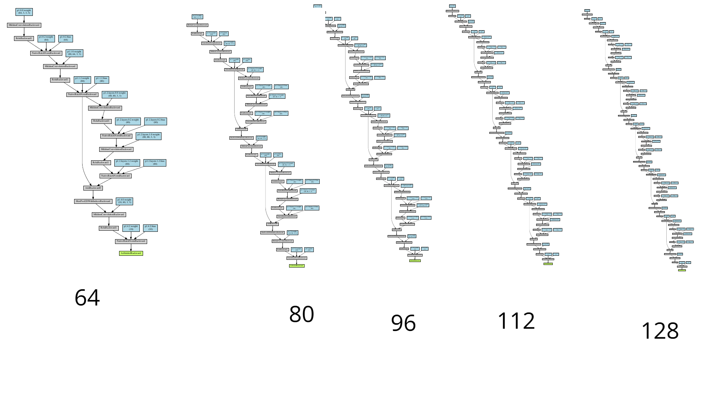

# PROGRESSIVELY GROWING NEURAL NETWORKS
- I wanted to have a way of progressively making my architecture go deeper by a step and retrain (Adding res blocks/conv blocks etc). so I wrote a bit of code to let me do that. Here is the architecture graphs for some of the steps in the way. Note that these were generated as the program ran and not separately.

> PRs welcome

## Todo
- Add transfer learning
- More blocks flexibility
- Better API

-  
